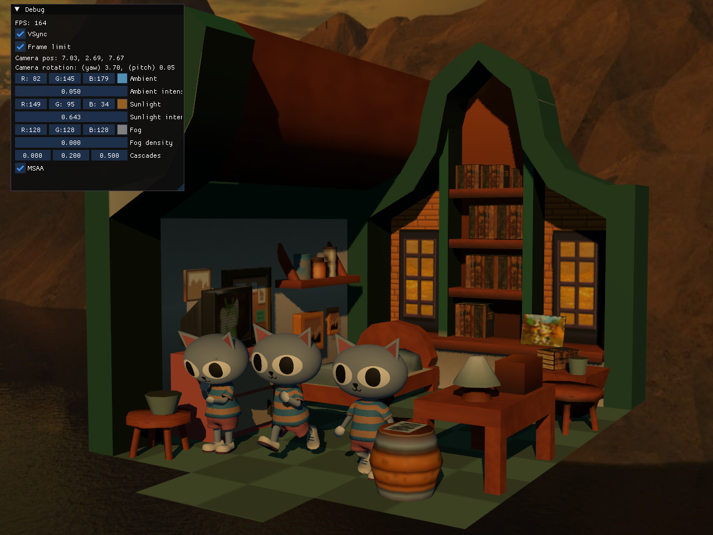

# EDBR - Elias Daler's Bikeshed Renderer

This project initially started for learning Vulkan but seems to be growing into a full-fledged renderer with which I'll write my games with.

## Current progress:

## Features:

* glTF scene loading
* Basic PBR lighting (no IBL) - support for normal, metallic/roughness maps and emissive textures
* Frustum culling
* Compute skinning + skeletal animation
* Exponential fog
* MSAA
* Bindless textures and samplers (via descriptor indexing)
* Directional, point and spot lights
* Cascaded shadow maps
* Efficient sprite and rect drawing (using batching)
* Text drawing with UTF-8 support
