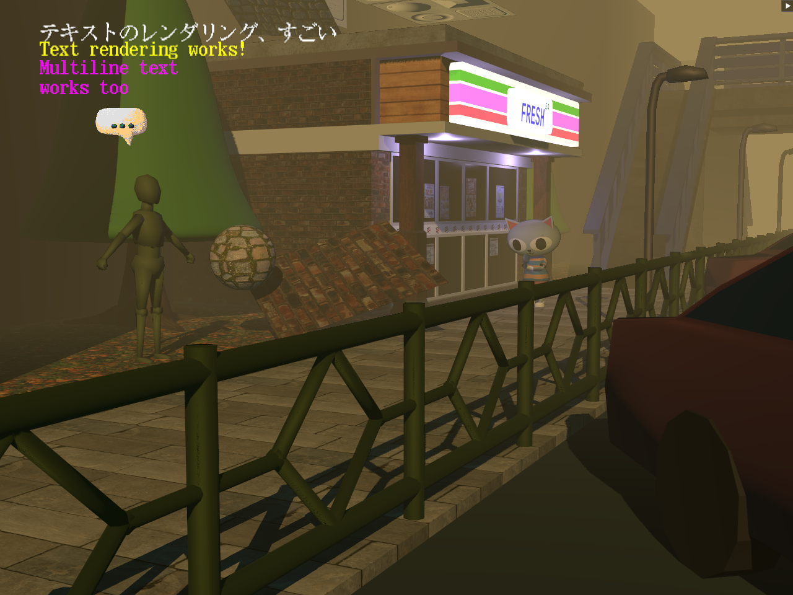
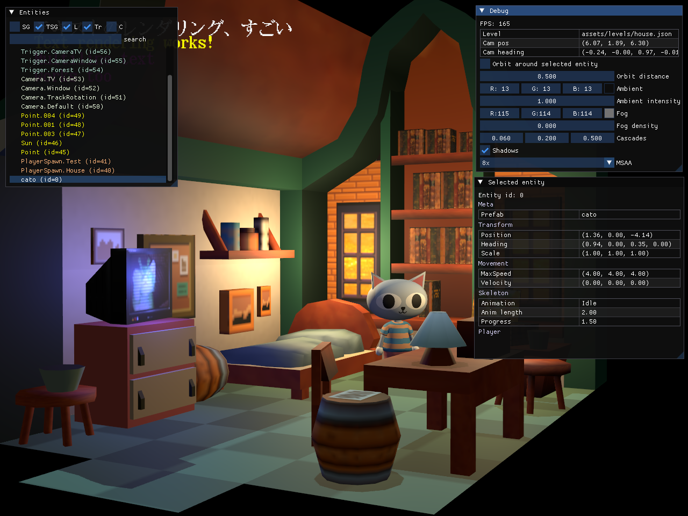
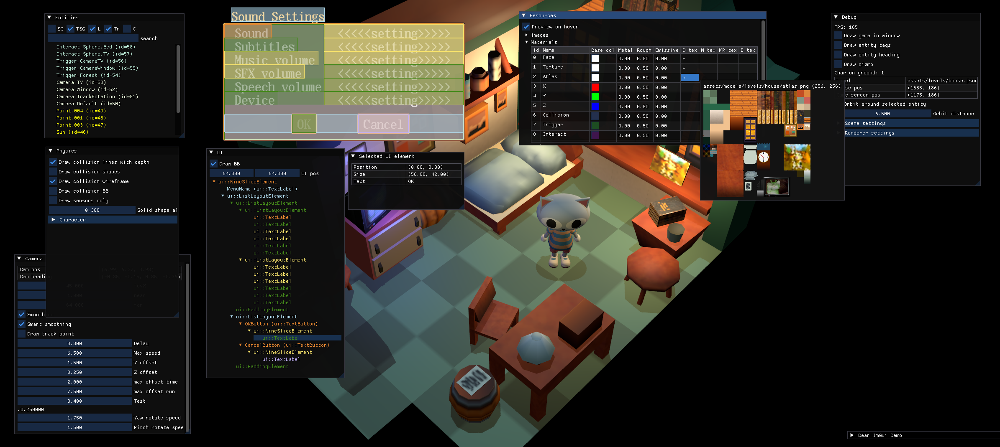

# EDBR - Elias Daler's Bikeshed Renderer

This project initially started for learning Vulkan but quickly grew into a full-fledged game engine with which I write my games with.

This is a monorepo and contains both the engine (in `edbr` directory) and various games/test projects (in `games` directory).

## Current progress

https://github.com/eliasdaler/edbr/assets/1285136/f689d3dd-5556-4a7c-9765-aa7724cf416b

## Features

* glTF scene loading
* Basic PBR lighting (no IBL) - support for normal, metallic/roughness maps and emissive textures
* Frustum culling
* Compute skinning + skeletal animation
* Exponential fog
* MSAA
* Bindless textures and samplers (via descriptor indexing)
* Directional, point and spot lights
* Cascaded shadow maps
* Efficient sprite and rect drawing (using batching)
* Text drawing with UTF-8 support
* Custom Dear ImGui backend with sRGB and bindless texture support
* Sound via OpenAL-soft
* ogg music playback
* Jolt Physics integration

## Vulkan usage

* Using Vulkan 1.3.
* No pipelines used, everything is dynamic rendering
* Bindless textures (aka descriptor indexing)
* Using Vulkan Memory Allocator and vk-bootstrap to make the code simpler

## License

This is a "source available" repository and not open source. Feel free to look around and use code for inspiration. When the time comes, I might release this under a more friendly open source license.
