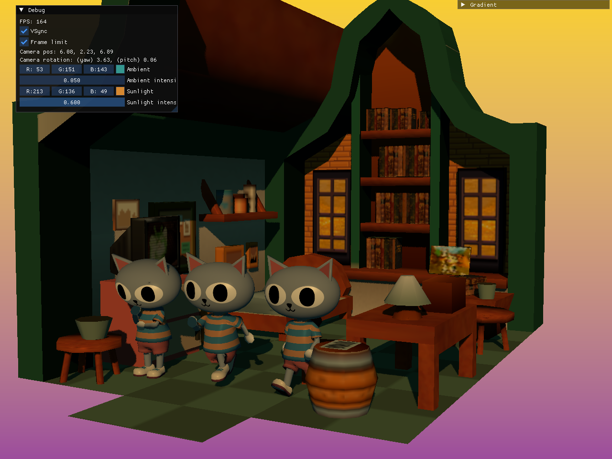

# EDBR - Elias Daler's Bikeshed Renderer

This is a project for bikeshedding and learning Vulkan.

Current progress:

* glTF scene loading
* Basic PBR lighting (no IBL)
* Frustum culling
* Cascaded shadow maps
* Compute skinning + skeletal animation
